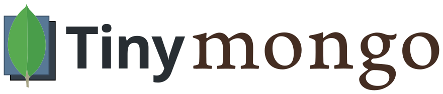

[](https://travis-ci.org/jjonesAtMoog/tinymongo)

# Purpose

A simple wrapper to make a drop in replacement for mongodb out of
[tinydb](http://tinydb.readthedocs.io/en/latest/).  This module is an
attempt to add an interface familiar to those currently using pymongo.

# Status

Unit testing is currently being worked on and functionality is being
added to the library.  Current coverage is 93%.  Current builds tested
on Python versions 2.7 and 3.3+.

# Installation

The latest stable release can be installed via `pip install tinymongo`.

The library is currently under rapid development and a more recent version
may be desired.

In this case, simply clone this repository, navigate
to the root project directory, and `python setup.py install`

or use `pip install git+https://github.com/schapman1974/tinymongo.git#egg=tinymongo`

This
is a pure python distribution and - thus - should require no external
compilers or tools besides those contained within Python itself.

# Examples

The quick start is shown below.  For a more detailed look at tinymongo,
take a look at demo.py within the repository.

```python
    from tinymongo import TinyMongoClient

    # you can include a folder name or absolute path
    # as a parameter if not it will default to "tinydb"
    connection = TinyMongoClient()

    # either creates a new database file or accesses an existing one named `my_tiny_database`
    db = connection.my_tiny_database

    # either creates a new collection or accesses an existing one named `users`
    collection = db.users

    # insert data adds a new record returns _id
    record_id = collection.insert_one({"username": "admin", "password": "admin", "module":"somemodule"})
    user_info = collection.find_one({"_id": record_id})  # returns the record inserted

    # you can also use it directly
    db.users.insert_one({"username": "admin"})

    # returns a list of all users of 'module'
    users = db.users.find({'module': 'module'})

    #update data returns True if successful and False if unsuccessful
    upd = db.users.update_one({"username": "admin"}, {"$set": {"module":"someothermodule"}})

    # Sorting users by its username DESC
    # omitting `filter` returns all records
    db.users.find(sort={'username': -1})

    # Pagination of the results
    # Getting the first 20 records
    db.users.find(sort={'username': -1}, skip=0, limit=20)
    # Getting next 20 records
    db.users.find(sort={'username': -1}, skip=20, limit=20)

    # Getting the total of records
    db.users.count()

```

# Custom Storages and Serializers

> HINT: Learn more about TinyDB storages and Serializers in [documentation](https://tinydb.readthedocs.io/en/latest/usage.html#storages-middlewares)

## Custom Storages

You have to subclass `TinyMongoClient` and provide custom storages like
CachingMiddleware or other available TinyDB Extension.

### Caching Middleware

```python
    from tinymongo import TinyMongoClient
    from tinydb.storages import JSONStorage
    from tinydb.middlewares import CachingMiddleware

    class CachedClient(TinyMongoClient):
        """This client has cache"""
        @property
        def _storage(self):
            return CachingMiddleware(JSONStorage)

    connection = CachedClient('/path/to/folder')
```

> HINT: You can nest middlewares: `FirstMiddleware(SecondMiddleware(JSONStorage))`


## Serializers

To convert your data to a format that is writable to disk TinyDB uses the Python JSON module by default. It's great when only simple data types are involved but it cannot handle more complex data types like custom classes.

To support serialization of complex types you can write
your own serializers using the `tinydb-serialization` extension.

First you need to install it `pip install tinydb-serialization`

## Handling datetime objects

You can create a serializer for the python `datetime` using
the following snippet:

```python
    from datetime import datetime
    from tinydb_serialization import Serializer

    class DatetimeSerializer(Serializer):
        OBJ_CLASS = datetime

        def __init__(self, format='%Y-%m-%dT%H:%M:%S', *args, **kwargs):
            super(DatetimeSerializer, self).__init__(*args, **kwargs)
            self._format = format

        def encode(self, obj):
            return obj.strftime(self._format)

        def decode(self, s):
            return datetime.strptime(s, self._format)
```

> NOTE: this serializer is available in `tinymongo.serializers.DateTimeSerializer`


Now you have to subclass `TinyMongoClient` and provide customs storage.

```python
    from tinymongo import TinyMongoClient
    from tinymongo.serializers import DateTimeSerializer
    from tinydb_serialization import SerializationMiddleware


    class CustomClient(TinyMongoClient):
        @property
        def _storage(self):
            serialization = SerializationMiddleware()
            serialization.register_serializer(DateTimeSerializer(), 'TinyDate')
            # register other custom serializers
            return serialization


    connection = CustomClient('/path/to/folder')
```

# Flask-Admin

This extension can work with Flask-Admin which gives a web based administrative
panel to your TinyDB. Flask-Admin has features like filtering, search, web forms to
perform CRUD (Create, Read, Update, Delete) of the TinyDB records.

You can find the example of Flask-Admin with TinyMongo in [Flask-Admin Examples Repository](https://github.com/flask-admin/flask-admin/tree/master/examples/tinymongo)

> NOTE: To use Flask-Admin you need to register a DateTimeSerialization as showed in the previous topic.

# Contributions

Contributions are welcome!  Currently, the most valuable contributions
would be:

* adding test cases
* adding functionality consistent with pymongo
* documentation
* identifying bugs and issues

# Future Development

I will also be adding support for gridFS by storing the files somehow and indexing them in a db like mongo currently does

More to come......

# License

MIT License
